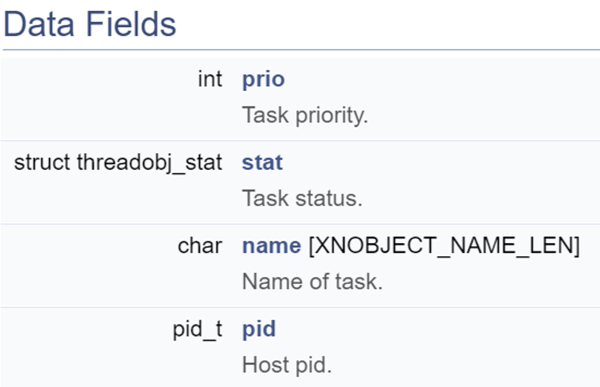
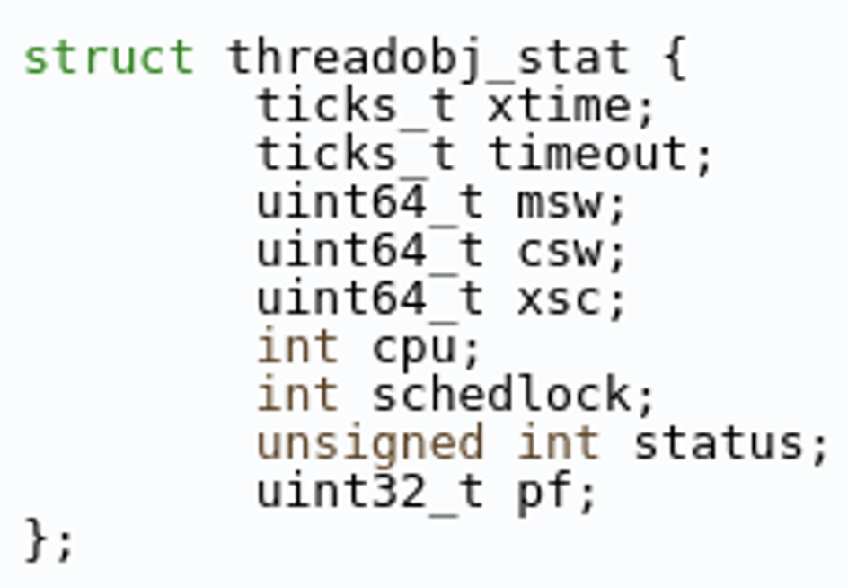
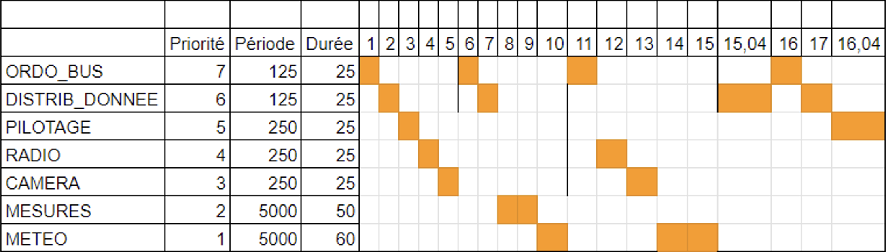
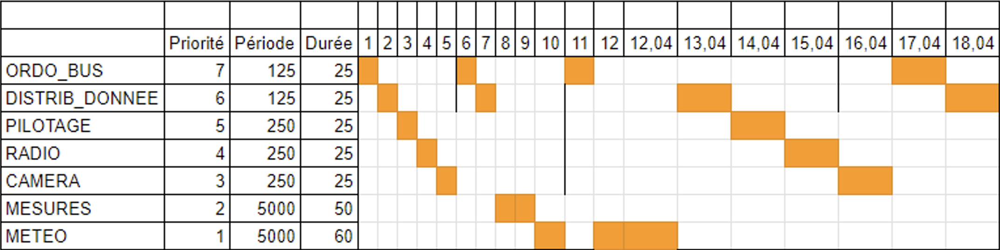

# Compte Rendu TP4 - Analyse Temps Réel sous Xenomai (Pathfinder) (MI11 / AI39 - Printemps 2025)

> [Ce compte rendu a été converti de notre readme (en markdown) en PDF. Nous vous conseillons de visionner notre rapport sur ce lien](https://github.com/tigrou23/UTC-AI39-TP/tree/main/tp4)

**Nom :** [Hugo Pereira](https://github.com/tigrou23) & Maher Zizouni

**UV :** AI39

**TP :** Xenomai - TP4

**Encadrant :** Guillaume Sanahuja

---

## Question 1 : Analyse des structures et fonctions de base

### Structure `task_descriptor`

La structure `task_descriptor` permet de définir tous les paramètres nécessaires à la création d'une tâche temps réel :

```c
typedef struct task_descriptor {
  RT_TASK task;                   // Structure de tâche Xenomai
  void (*task_function)(void*);   // Pointeur vers la fonction exécutée
  RTIME period;                   // Périodicité de la tâche
  RTIME duration;                 // Durée d'exécution simulée
  int priority;                   // Priorité Alchemy (1 = basse, 99 = haute)
  bool use_resource;              // Booléen : la tâche accède-t-elle au bus 1553 ?
} task_descriptor;
```

### Fonction `create_and_start_rt_task`

Cette fonction encapsule le processus de création et lancement d'une tâche temps réel avec Xenomai :

```c
int create_and_start_rt_task(struct task_descriptor* desc, RTIME first_release_point, char* name);
```

**Comportement** :

1. `rt_task_create(...)` : crée la tâche avec une priorité et un nom donnés.
2. `rt_task_set_periodic(...)` : spécifie la première activation et la périodicité.
3. `rt_task_start(...)` : démarre la tâche avec sa fonction et ses paramètres.

### Fonction `rt_task(void*)`

Cette fonction est celle qui est exécutée par défaut pour chaque tâche. Elle :

* Attend un signal du sémaphore `start_sem` avant d'exécuter la boucle périodique.
* Si la tâche utilise le bus 1553 (`use_resource == true`), elle appelle `acquire_resource()` et `release_resource()`.
* Exécute un `busy_wait()` simulant la charge CPU sur une durée précise.

**Avantage** : permet de définir des comportements génériques pour les tâches, qui peuvent être spécialisés ensuite.

---

## Question 2 — Utilité de `first_release_point` et `start_sem`

### `first_release_point`

Cette variable est un **repère temporel global** permettant de synchroniser **le démarrage périodique de toutes les tâches**.

#### Dans le code :

```c
RTIME first_release_point = rt_timer_read() + 15000000;
```

#### Rôle :

* Elle indique **le moment précis (en ns)** à partir duquel toutes les tâches vont commencer leur cycle périodique.
* Assure que **toutes les tâches démarrent simultanément** (ou avec un décalage prévu).
* Permet de :

  * tester le système dans un environnement bien contrôlé,
  * produire des **chronogrammes cohérents**,
  * éviter les artefacts dus à un démarrage asynchrone.

---

### `start_sem`

`start_sem` est un **sémaphore de synchronisation**, initialisé à 0, utilisé pour **bloquer les tâches secondaires** jusqu'à ce que le `main` les libère.

#### Dans le code :

```c
RT_SEM start_sem;
rt_sem_create(&start_sem,"start_semaphore",0,S_PRIO);
```

Chaque tâche secondaire appelle :

```c
rt_sem_p(&start_sem,TM_INFINITE);
```

#### Rôle :

* Synchroniser le démarrage réel des tâches **après leur création** et la définition de leur périodicité.
* Évite qu’une tâche commence **avant que toutes les autres soient prêtes**.

#### Libération :

```c
rt_sem_broadcast(&start_sem);
```

* Le `main` peut appeler `rt_sem_broadcast()` pour débloquer toutes les tâches **en même temps**.

---

Ces deux mécanismes (`first_release_point` et `start_sem`) sont donc cruciaux pour garantir une **expérimentation contrôlée, reproductible et ordonnée** du comportement temps réel du système.

---

## Question 3 — Étapes dans `main()` pour créer et synchroniser plusieurs tâches

### Étapes à réaliser dans `main()`

1. **Définir le point de synchronisation global** :

   ```c
   RTIME first_release_point = rt_timer_read() + 15000000;
   ```

   > Donne aux tâches une base de temps commune, évite le démarrage immédiat désynchronisé.

2. **Créer un sémaphore global** :

   ```c
   rt_sem_create(&start_sem, "start_semaphore", 0, S_PRIO);
   ```

   > Permet de bloquer toutes les tâches avant le démarrage effectif, pour assurer un démarrage simultané.

3. **Initialiser les structures des tâches** (`task_descriptor`) avec :

   * `period` : période d’activation
   * `duration` : durée du `busy_wait`
   * `priority` : priorité Xenomai (plus petit = plus prioritaire)
   * `use_resource` : booléen indiquant s’il faut simuler l’usage d’une ressource critique

4. **Créer et lancer chaque tâche avec `create_and_start_rt_task()`**

   ```c
   create_and_start_rt_task(&desc1, first_release_point, "TASK1");
   create_and_start_rt_task(&desc2, first_release_point, "TASK2");
   ...
   ```

   > Chaque tâche est :
   >
   > * Créée (`rt_task_create`)
   > * Planifiée périodiquement (`rt_task_set_periodic`)
   > * Lancée (`rt_task_start`)

5. **Synchroniser avec `rt_task_sleep_until(first_release_point)`**

   ```c
   rt_task_sleep_until(first_release_point);
   ```

   > Le `main()` attend jusqu’à ce que toutes les tâches soient prêtes à démarrer.

6. **Libérer toutes les tâches simultanément** avec un `broadcast` :

   ```c
   rt_sem_broadcast(&start_sem);
   ```

   > Toutes les tâches appelant `rt_sem_p()` se débloquent et démarrent en même temps.

7. **Terminer proprement** :

   ```c
   rt_sem_delete(&start_sem);
   return EXIT_SUCCESS;
   ```

### Ajout de la tâche : ORDO\_BUS

```c
struct task_descriptor ORDO_BUS = {
  .task_function = rt_task,
  .period = 125000000,         // 125ms
  .duration = 2500000,         // 25ms
  .priority = 27,
  .use_resource = false
};

create_and_start_rt_task(&ORDO_BUS, first_release_point, "ORDO_BUS");
```
---

## Question 4 — `rt_task_name`, `RT_TASK_INFO` et `threadobj_stat`

La fonction `rt_task_name()` est une fonction présente dans le code fourni. Elle déclare une structure `RT_TASK_INFO` et remplit la structure grâce à la fonction `rt_task_inquire()`. Cette fonction permet (d’après la documentation de l’API Alchemy) d’obtenir des informations sur la tâche passée en premier argument. Si le premier argument est vide, ce qui est le cas ici, elle retourne les informations sur la tâche en cours actuellement (et les stocke à l’adresse de la structure `RT_TASK_INFO` passée en second argument.

Une fois la structure remplie, notre fonction ne fait que renvoyer le nom de la tâche courante.

Cette structure `RT_TASK_INFO` permet de stocker les données suivantes :



On trouve donc la priorité de la tâche, son nom, ainsi que le PID du processus. Nous trouvons également la structure `threadobj_stat`. Cette structure ressemble beaucoup aux données affichées lors de l’utilisation de la commande `stat` lors du dernier TP. On retrouve les Mode Switches, et Context Switches ou encore le Status :



---

## Question 5

Nous souhaitons réaliser la fonction `busy_wait()`. Cette fonction permet de simuler le temps d’exécution d’une tâche. Nous réalisons donc une attente active pour pas que la tâche puisse être interrompue.

Il s’agit d’abord d’obtenir le temps de fin d’attente de notre boucle active. Pour cela, nous réutilisons la fonction `rt_task_inquire()` mentionnée plus tôt pour remplir une structure `RT_TASK_INFO` sur la tâche courante. Dans cette structure nous récupérons la valeur `xtime` (`info.stat.xtime`). Le temps de fin de l’attente est le temps actuel (récupéré en argument) + `xtime`.

Enfin, nous réalisons l’attente active. Il ne faut pas oublier de mettre à jour la valeur de `xtime` en rappelant `rt_task_inquire()` à chaque fois.

### Simulation précise avec `xtime`

On utilise le champ `xtime` ("execution time") de la structure `threadobj_stat` pour garantir que le `busy_wait()` correspond bien à **du temps CPU consommé effectif**, même en cas de préemption.

### 🔍 Détails techniques

`RT_TASK_INFO` est une structure retournée par `rt_task_inquire()` :

```c
struct RT_TASK_INFO {
    int prio;                      // priorité de la tâche
    struct threadobj_stat stat;   // structure contenant xtime
    char name[XNOBJECT_NAME_LEN]; // nom de la tâche
    pid_t pid;                    // PID associé à la tâche
};
```

La structure `threadobj_stat`, issue de `include/alchemy/task.h`, contient notamment le champ :

```c
RTIME xtime; // temps CPU cumulé utilisé par la tâche
```

### Implémentation

```c
#include <alchemy/task.h>

void busy_wait(RTIME duration_ns) {
    RT_TASK_INFO info;

    if (rt_task_inquire(NULL, &info) != 0) {
        rt_printf("Error: cannot retrieve task info\n");
        return;
    }

    RTIME start_xtime = info.stat.xtime;
    RTIME current_xtime;

    do {
        rt_task_inquire(NULL, &info);
        current_xtime = info.stat.xtime;
    } while ((current_xtime - start_xtime) < duration_ns);
}
```
---

## Résultat observé (Question 6)

Nous souhaitons mesurer et vérifier les temps d’exécution des tâches, donc on encadre l’attente `busy_wait()` par des affichages de `ms_time_since_start()` qui donne le temps en millisecondes depuis le lancement.

Pour exécuter le programme, nous devons le compiler. Pour cela il faut comme d’habitude sourcer :

```
. /opt/poky/3.1.23/cortexa7thf-neon-vfpv4/environment-setup-cortexa7t2hf-neon-vfpv4-poky-linux-gnueabi
```

Puis on compile avec make.

### Données d’exécution

```
started task ORDO_BUS, period 125ms, duration 25ms, use resource 0
started main program at 0.000ms
[0.033 ms] START ORDO_BUS
[25.048 ms] END ORDO_BUS
[124.970 ms] START ORDO_BUS
[149.994 ms] END ORDO_BUS
[249.968 ms] START ORDO_BUS
[274.986 ms] END ORDO_BUS
[374.967 ms] START ORDO_BUS
[399.985 ms] END ORDO_BUS
[499.968 ms] START ORDO_BUS
[524.985 ms] END ORDO_BUS
[624.967 ms] START ORDO_BUS
[649.987 ms] END ORDO_BUS
[749.968 ms] START ORDO_BUS
[774.986 ms] END ORDO_BUS
```

### Analyse temporelle

* Le **périodicité de 125ms** est respectée avec un excellent degré de précision (écarts < 0.05 ms).
* Le **temps d'exécution de 25ms** est atteint quasiment exactement à chaque fois.
* Le **démarrage** de la première tâche correspond bien à un `first_release_point` global et à un `rt_sem_p()`.

> Le timing est donc correct. Ce résultat était attendu, puisque nous n’avons qu’une seule tâche, si le code est correct, les échéances ne peuvent qu’être respectées.

---

## Question 7 : Ajout de tâches avec accès concurrent à une ressource critique (bus 1553)

Pour gérer l’accès au **bus 1553** (ressource critique), on utilise un **sémaphore binaire** Xenomai :

```c
RT_SEM resource_sem;
```

### Initialisation du sémaphore

```c
rt_sem_create(&resource_sem, "bus_1553", 1, S_PRIO);
```

* Valeur initiale : `1` → la ressource est disponible
* Type : `S_PRIO` → prioritaire, pour éviter les inversions de priorité

### Accès à la ressource

```c
void acquire_resource(void) {
  rt_sem_p(&resource_sem, TM_INFINITE);
}

void release_resource(void) {
  rt_sem_v(&resource_sem);
}
```

### Tests fonctionnels

* Plusieurs tâches peuvent maintenant demander à accéder à la **même ressource critique**.
* Les accès sont **mutuellement exclusifs** grâce au sémaphore.
* L’enchaînement des tâches dépend de la priorité et de la disponibilité de la ressource.

### Étapes ajoutées dans `main()`

* Création du `resource_sem`
* Définition et lancement des tâches supplémentaires accédant au bus avec `use_resource = true`

### Tests fonctionnels

* Plusieurs tâches peuvent maintenant demander à accéder à la **même ressource critique**.
* Les accès sont **mutuellement exclusifs** grâce au sémaphore.
* L’enchaînement des tâches dépend de la priorité et de la disponibilité de la ressource.

### Résultats expérimentaux

```
root@joypinote-xenomai:~/tp4# ./pathfinder 
started task ORDO_BUS, period 125ms, duration 25ms, use resource 0
started task DISTRIB_DONNEES, period 125ms, duration 25ms, use resource 1
started task PILOTAGE, period 250ms, duration 25ms, use resource 1
started task RADIO, period 250ms, duration 25ms, use resource 0
started task CAMERA, period 250ms, duration 25ms, use resource 0
started task MESURES, period 5000ms, duration 50ms, use resource 1
started task METEO, period 5000ms, duration 40ms, use resource 1
started main program at 0.000ms
[0.056 ms] START ORDO_BUS
[25.071 ms] END ORDO_BUS
[25.093 ms] START DISTRIB_DONNEES
[50.105 ms] END DISTRIB_DONNEES
[50.121 ms] START PILOTAGE
[75.134 ms] END PILOTAGE
[75.149 ms] START RADIO
[100.161 ms] END RADIO
[100.177 ms] START CAMERA
[124.975 ms] START ORDO_BUS
[149.987 ms] END ORDO_BUS
[150.000 ms] START DISTRIB_DONNEES
[175.011 ms] END DISTRIB_DONNEES
[175.242 ms] END CAMERA
[175.258 ms] START MESURES
[225.269 ms] END MESURES
[225.284 ms] START METEO
[249.977 ms] START ORDO_BUS
[274.990 ms] END ORDO_BUS
[275.002 ms] START DISTRIB_DONNEES
[275.017 ms] START PILOTAGE
[275.030 ms] START RADIO
[300.043 ms] END RADIO
[300.056 ms] START CAMERA
[325.068 ms] END CAMERA
[340.406 ms] END METEO
[365.421 ms] END DISTRIB_DONNEES
[374.974 ms] START ORDO_BUS
[399.984 ms] END ORDO_BUS
[399.997 ms] START DISTRIB_DONNEES
[415.480 ms] END PILOTAGE
[440.494 ms] END DISTRIB_DONNEES
[499.982 ms] START ORDO_BUS
[525.003 ms] END ORDO_BUS
[525.019 ms] START DISTRIB_DONNEES
[550.031 ms] END DISTRIB_DONNEES
[550.045 ms] START PILOTAGE
[575.058 ms] END PILOTAGE
[575.072 ms] START RADIO
[600.083 ms] END RADIO
[600.096 ms] START CAMERA
[624.974 ms] START ORDO_BUS
[649.986 ms] END ORDO_BUS
[649.998 ms] START DISTRIB_DONNEES
[675.010 ms] END DISTRIB_DONNEES
[675.160 ms] END CAMERA
[749.982 ms] START ORDO_BUS
[775.004 ms] END ORDO_BUS
[775.018 ms] START DISTRIB_DONNEES
[800.031 ms] END DISTRIB_DONNEES
[800.045 ms] START PILOTAGE
[825.057 ms] END PILOTAGE
[825.069 ms] START RADIO
[850.081 ms] END RADIO
[850.094 ms] START CAMERA
[874.973 ms] START ORDO_BUS
[899.986 ms] END ORDO_BUS
[899.998 ms] START DISTRIB_DONNEES
[925.008 ms] END DISTRIB_DONNEES
[925.157 ms] END CAMERA
[999.982 ms] START ORDO_BUS
[1025.002 ms] END ORDO_BUS
[1025.018 ms] START DISTRIB_DONNEES
[1050.031 ms] END DISTRIB_DONNEES
[1050.045 ms] START PILOTAGE
[1075.058 ms] END PILOTAGE
[1075.071 ms] START RADIO
[1100.083 ms] END RADIO
[1100.096 ms] START CAMERA
[1124.974 ms] START ORDO_BUS
[1149.986 ms] END ORDO_BUS
[1149.999 ms] START DISTRIB_DONNEES
[1175.011 ms] END DISTRIB_DONNEES
[1175.162 ms] END CAMERA
[1249.981 ms] START ORDO_BUS
[1275.002 ms] END ORDO_BUS
[1275.017 ms] START DISTRIB_DONNEES
[1300.028 ms] END DISTRIB_DONNEES
[1300.042 ms] START PILOTAGE
[1325.053 ms] END PILOTAGE
[1325.067 ms] START RADIO
[1350.079 ms] END RADIO
[1350.091 ms] START CAMERA
[1374.974 ms] START ORDO_BUS
[1399.986 ms] END ORDO_BUS
[1399.998 ms] START DISTRIB_DONNEES
[1425.010 ms] END DISTRIB_DONNEES
[1425.156 ms] END CAMERA
[1499.982 ms] START ORDO_BUS
[1525.002 ms] END ORDO_BUS
[1525.018 ms] START DISTRIB_DONNEES
[1550.031 ms] END DISTRIB_DONNEES
[1550.045 ms] START PILOTAGE
[1575.057 ms] END PILOTAGE
[1575.070 ms] START RADIO
[1600.081 ms] END RADIO
[1600.094 ms] START CAMERA
[1624.973 ms] START ORDO_BUS
[1649.986 ms] END ORDO_BUS
[1649.999 ms] START DISTRIB_DONNEES
[1675.010 ms] END DISTRIB_DONNEES
[1675.159 ms] END CAMERA
```

### Analyse

* Les tâches critiques attendent leur tour correctement sans interférer.
* Le **sémaphore binaire fonctionne comme verrou exclusif**, ce qui permet d’ordonner efficacement les accès concurrents.
* Le **comportement temporel est stable**, sans famine ni inversion de priorité visible.

---

## Question 8 — Implémentation du mécanisme de sécurité entre ORDO_BUS et DISTRIB_DONNEES

Le but de cette sécurité est d’assurer que la tâche critique `DISTRIB_DONNEES` s’exécute au moins une fois entre deux activations successives de `ORDO_BUS`. En effet, `ORDO_BUS` dépend des données mises à jour par `DISTRIB_DONNEES`. Si cette dernière ne s’exécute pas, le comportement du système devient incohérent, ce qui justifie un reset immédiat.

Pour mettre en œuvre cette vérification, nous utilisons un sémaphore supplémentaire `distrib_done_sem` qui permet à `DISTRIB_DONNEES` de signaler sa bonne exécution, et à `ORDO_BUS` de la vérifier à chaque cycle.

### Comportement des deux tâches

- *DISTRIB_DONNEES*
  - À la fin de son exécution, la tâche appelle `rt_sem_v(&distrib_done_sem);` pour indiquer qu’elle a bien tourné.
  - Ce signal est déposé dans le sémaphore `distrib_done_sem`.

- *ORDO_BUS*
  - À chaque activation, la tâche appelle `rt_sem_p(&distrib_done_sem, TM_NONBLOCK)`.
  - Si le sémaphore contient un jeton, cela signifie que `DISTRIB_DONNEES` a bien été exécutée depuis le dernier cycle → l’exécution continue normalement.
  - Si aucun jeton n’est disponible (retour `-EWOULDBLOCK`), alors `ORDO_BUS` détecte un défaut : `DISTRIB_DONNEES` ne s’est pas exécutée à temps → on affiche `RESET SYSTEM` et on quitte le programme avec `exit(EXIT_FAILURE)`.

## Question 9

> Tout se déroule normalement quand on met à 40 ms (duration = 40000000) pour METEO :

```
root@joypinote-xenomai:~/tp4# ./pathfinder 
started task ORDO_BUS, period 125ms, duration 25ms, use resource 0
started task DISTRIB_DONNEES, period 125ms, duration 25ms, use resource 1
started task PILOTAGE, period 250ms, duration 25ms, use resource 1
started task RADIO, period 250ms, duration 25ms, use resource 0
started task CAMERA, period 250ms, duration 25ms, use resource 0
started task MESURES, period 5000ms, duration 50ms, use resource 1
started task METEO, period 5000ms, duration 40ms, use resource 1
started main program at 0.000ms
[0.055 ms] START ORDO_BUS
[25.070 ms] END ORDO_BUS
[25.091 ms] START DISTRIB_DONNEES
[50.103 ms] END DISTRIB_DONNEES
[50.120 ms] START PILOTAGE
[75.131 ms] END PILOTAGE
[75.147 ms] START RADIO
[100.158 ms] END RADIO
[100.173 ms] START CAMERA
[124.968 ms] START ORDO_BUS
[149.980 ms] END ORDO_BUS
[149.994 ms] START DISTRIB_DONNEES
[175.006 ms] END DISTRIB_DONNEES
[175.242 ms] END CAMERA
[175.258 ms] START MESURES
[225.268 ms] END MESURES
[225.284 ms] START METEO
[249.970 ms] START ORDO_BUS
[274.981 ms] END ORDO_BUS
[275.008 ms] START RADIO
[300.018 ms] END RADIO
[300.031 ms] START CAMERA
[325.043 ms] END CAMERA
[340.386 ms] END METEO
[340.398 ms] START DISTRIB_DONNEES
[365.410 ms] END DISTRIB_DONNEES
[365.424 ms] START PILOTAGE
[374.967 ms] START ORDO_BUS
[399.979 ms] END ORDO_BUS
[415.471 ms] END PILOTAGE
[415.483 ms] START DISTRIB_DONNEES
[440.494 ms] END DISTRIB_DONNEES
[499.976 ms] START ORDO_BUS
[524.998 ms] END ORDO_BUS
[525.014 ms] START DISTRIB_DONNEES
[550.026 ms] END DISTRIB_DONNEES
[550.041 ms] START PILOTAGE
[575.053 ms] END PILOTAGE
[575.067 ms] START RADIO
[600.077 ms] END RADIO
[600.089 ms] START CAMERA
[624.967 ms] START ORDO_BUS
[649.979 ms] END ORDO_BUS
[649.992 ms] START DISTRIB_DONNEES
[675.004 ms] END DISTRIB_DONNEES
[675.156 ms] END CAMERA
^C
```

> Mais quand on met à 60, alors on remarque que notre système de sécurité se déclenche ! 

```
root@joypinote-xenomai:~/tp4# ./pathfinder 
started task ORDO_BUS, period 125ms, duration 25ms, use resource 0
started task DISTRIB_DONNEES, period 125ms, duration 25ms, use resource 1
started task PILOTAGE, period 250ms, duration 25ms, use resource 1
started task RADIO, period 250ms, duration 25ms, use resource 0
started task CAMERA, period 250ms, duration 25ms, use resource 0
started task MESURES, period 5000ms, duration 50ms, use resource 1
started task METEO, period 5000ms, duration 60ms, use resource 1
started main program at 0.000ms
[0.056 ms] START ORDO_BUS
[25.072 ms] END ORDO_BUS
[25.092 ms] START DISTRIB_DONNEES
[50.105 ms] END DISTRIB_DONNEES
[50.122 ms] START PILOTAGE
[75.134 ms] END PILOTAGE
[75.150 ms] START RADIO
[100.160 ms] END RADIO
[100.175 ms] START CAMERA
[124.975 ms] START ORDO_BUS
[149.985 ms] END ORDO_BUS
[149.998 ms] START DISTRIB_DONNEES
[175.008 ms] END DISTRIB_DONNEES
[175.237 ms] END CAMERA
[175.253 ms] START MESURES
[225.264 ms] END MESURES
[225.279 ms] START METEO
[249.977 ms] START ORDO_BUS
[274.987 ms] END ORDO_BUS
[275.014 ms] START RADIO
[300.024 ms] END RADIO
[300.037 ms] START CAMERA
[325.046 ms] END CAMERA
[360.380 ms] END METEO
[360.391 ms] START DISTRIB_DONNEES
RESET SYSTEM: DISTRIB_DONNEES NON EXECUTÉE
[385.416 ms] END DISTRIB_DONNEES
[385.436 ms] START PILOTAGE
[410.448 ms] END PILOTAGE
[410.459 ms] START DISTRIB_DONNEES
[435.469 ms] END DISTRIB_DONNEES
```

### Problème d'inversion de priorité

On remarque un problème d’inversion de priorité. En effet, la tâche `ORDO_BUS` est effectuée alors que `DISTRIB_DONNEE est lancé et de priorité plus haute.



### Proposition pour résoudre ce problème 

Le mutex de Xenomai supporte par défaut l’héritage de priorité. Cela signifie que lorsqu’une tâche prioritaire est bloquée sur un mutex détenu par une tâche moins prioritaire, la priorité de cette dernière est temporairement augmentée pour éviter le blocage prolongé.

1. Remplacer la déclaration du sémaphore

```c
#include <alchemy/mutex.h>

RT_MUTEX resource_mutex;
```

3. Modifier les fonctions `acquire_resource` et `release_resource`

```c
void acquire_resource(void) {
  rt_mutex_acquire(&resource_mutex, TM_INFINITE);
}

void release_resource(void) {
  rt_mutex_release(&resource_mutex);
}
```

3. Modifier l’initialisation dans main()

On remplace :

```c
if (rt_sem_create(&resource_sem, "bus_1553", 1, S_PRIO) != 0)

// PAR

if (rt_mutex_create(&resource_mutex, "bus_1553") != 0)
```

### Compilation conditionnelle avec #ifdef

Pour permettre de basculer facilement entre version sémaphore et version mutex avec héritage de priorité, on ajoute au début de ton code :

```c
#define USE_MUTEX
```

Et donc on aura : 

```c
#ifdef USE_MUTEX
#include <alchemy/mutex.h>
RT_MUTEX resource_mutex;
#else
#include <alchemy/sem.h>
RT_SEM resource_sem;
#endif
```

Et dans `acquire_resource()` :

```c
void acquire_resource(void) {
#ifdef USE_MUTEX
rt_mutex_acquire(&resource_mutex, TM_INFINITE);
#else
rt_sem_p(&resource_sem, TM_INFINITE);
#endif
}

void release_resource(void) {
#ifdef USE_MUTEX
rt_mutex_release(&resource_mutex);
#else
rt_sem_v(&resource_sem);
#endif
}
```

## Question 11

Après avoir testé notre programme, nous pouvons dessiner ce chronogramme : 



Le problème d’inversion de priorité a été corrigé.

Quand `METEO` devient plus longue (ex. 60ms) et empêche `DISTRIB_DONNEES` d’accéder au bus à temps, l’utilisation d’un mutex avec héritage de priorité permet à `METEO` de recevoir temporairement la priorité de `DISTRIB_DONNEES`, évitant ainsi le `RESET SYSTEM`.

## Question 12 

[Code Source](resources/pathfinder.c) : 

```c
#include <stdio.h>
#include <stdlib.h>
#include <stdbool.h>

#include <alchemy/task.h>
#include <alchemy/timer.h>
#include <alchemy/sem.h>
#include <alchemy/mutex.h>

#define TASK_MODE T_JOINABLE
#define TASK_STKSZ 0

// Déclaration des sémaphores
RT_SEM start_sem;
RT_SEM distrib_done_sem;

#ifdef USE_MUTEX
RT_MUTEX resource_mutex;
#else
RT_SEM resource_sem;
#endif

// Descripteur de tâche
typedef struct task_descriptor {
  RT_TASK task;
  void (*task_function)(void*);
  RTIME period;
  RTIME duration;
  int priority;
  bool use_resource;
} task_descriptor;

// Renvoie le nom de la tâche courante (utile pour les logs)
char* rt_task_name(void) {
  static RT_TASK_INFO info;
  rt_task_inquire(NULL, &info);
  return info.name;
}

// Renvoie le temps écoulé depuis le démarrage du programme en millisecondes
float ms_time_since_start(void) {
  static RTIME init_time = 0;
  if (init_time == 0) init_time = rt_timer_read();
  return (rt_timer_read() - init_time) / 1000000.0;
}

// Acquisition du bus (mutex pour la ressource critique)
void acquire_resource(void) {
#ifdef USE_MUTEX
  rt_mutex_acquire(&resource_mutex, TM_INFINITE);
#else
  rt_sem_p(&resource_sem, TM_INFINITE);
#endif
}

// Libération du bus
void release_resource(void) {
#ifdef USE_MUTEX
  rt_mutex_release(&resource_mutex);
#else
  rt_sem_v(&resource_sem);
#endif
}

// Simulation d'une exécution active (busy wait) pour une durée donnée
void busy_wait(RTIME duration_ns) {
  struct threadobj_stat stat;
  RT_TASK_INFO info;
  // On utilise xtime pour mesurer une durée d'exécution active sans dormir
  if (rt_task_inquire(NULL, &info) != 0) {
    rt_printf("Error: cannot retrieve task info\n");
    return;
  }
  RTIME start_xtime = info.stat.xtime;
  RTIME current_xtime;
  do {
    rt_task_inquire(NULL, &info);
    current_xtime = info.stat.xtime;
  } while ((current_xtime - start_xtime) < duration_ns);
}

// Tâche DISTRIB_DONNEES — exécute et signale à ORDO_BUS
void distrib_donnees_task(void *cookie) {
  struct task_descriptor* params = (struct task_descriptor*)cookie;
  // Affiche les paramètres de la tâche au démarrage pour le debug
  rt_printf("started task %s, period %ims, duration %ims, use resource %i\n",
            rt_task_name(), (int)(params->period / 1000000),
            (int)(params->duration / 1000000), params->use_resource);
  // Attend le signal de démarrage global avant de commencer l'exécution périodique
  rt_sem_p(&start_sem, TM_INFINITE);

  while (1) {
    // Attend la prochaine activation périodique
    rt_task_wait_period(NULL);

    if (params->use_resource) acquire_resource();
    float start_time = ms_time_since_start();
    rt_printf("[%.3f ms] START %s\n", start_time, rt_task_name());

    busy_wait(params->duration);

    float end_time = ms_time_since_start();
    rt_printf("[%.3f ms] END %s\n", end_time, rt_task_name());
    if (params->use_resource) release_resource();

    // Signale à ORDO_BUS que cette tâche a été exécutée correctement
    rt_sem_v(&distrib_done_sem); // Signale que la tâche s'est exécutée
  }
}

// Tâche ORDO_BUS — vérifie si DISTRIB_DONNEES a été exécutée
void ordo_bus_task(void *cookie) {
  struct task_descriptor* params = (struct task_descriptor*)cookie;
  // Affiche les paramètres de la tâche au démarrage pour le debug
  rt_printf("started task %s, period %ims, duration %ims, use resource %i\n",
            rt_task_name(), (int)(params->period / 1000000),
            (int)(params->duration / 1000000), params->use_resource);
  rt_sem_p(&start_sem, TM_INFINITE);

  while (1) {
    // Attente du prochain réveil périodique défini par la période de la tâche
    rt_task_wait_period(NULL);

    // Vérifie si DISTRIB_DONNEES s'est exécutée depuis la dernière période
    if (rt_sem_p(&distrib_done_sem, TM_NONBLOCK) == -EWOULDBLOCK) {
      rt_printf("RESET SYSTEM: DISTRIB_DONNEES NON EXECUTÉE\n");
      exit(EXIT_FAILURE); // Arrêt du programme
      // Arrêt immédiat du système car DISTRIB_DONNEES n’a pas été exécutée à temps
    }

    if (params->use_resource) acquire_resource();
    float start_time = ms_time_since_start();
    rt_printf("[%.3f ms] START %s\n", start_time, rt_task_name());

    busy_wait(params->duration);

    float end_time = ms_time_since_start();
    rt_printf("[%.3f ms] END %s\n", end_time, rt_task_name());
    if (params->use_resource) release_resource();
  }
}

// Tâche générique pour les autres tâches
void rt_task_default(void *cookie) {
  struct task_descriptor* params = (struct task_descriptor*)cookie;
  // Affiche les paramètres de la tâche au démarrage pour le debug
  rt_printf("started task %s, period %ims, duration %ims, use resource %i\n",
            rt_task_name(), (int)(params->period / 1000000),
            (int)(params->duration / 1000000), params->use_resource);
  // Synchronisation avec le démarrage global avant l'exécution
  rt_sem_p(&start_sem, TM_INFINITE);

  while (1) {
    // Attente du prochain réveil périodique défini par la période de la tâche
    rt_task_wait_period(NULL);
    if (params->use_resource) acquire_resource();

    float start_time = ms_time_since_start();
    rt_printf("[%.3f ms] START %s\n", start_time, rt_task_name());

    busy_wait(params->duration);

    float end_time = ms_time_since_start();
    rt_printf("[%.3f ms] END %s\n", end_time, rt_task_name());

    if (params->use_resource) release_resource();
  }
}

// Fonction pour créer et démarrer une tâche
int create_and_start_rt_task(struct task_descriptor* desc, RTIME first_release_point, char* name) {
  int status = rt_task_create(&desc->task, name, TASK_STKSZ, desc->priority, TASK_MODE);
  // Affichage d'une erreur si la création/la configuration/le lancement échoue
  if (status != 0) {
    printf("error creating task %s\n", name);
    return status;
  }

  status = rt_task_set_periodic(&desc->task, first_release_point, desc->period);
  // Affichage d'une erreur si la création/la configuration/le lancement échoue
  if (status != 0) {
    printf("error setting period on task %s\n", name);
    return status;
  }

  status = rt_task_start(&desc->task, desc->task_function, desc);
  // Affichage d'une erreur si la création/la configuration/le lancement échoue
  if (status != 0) {
    printf("error starting task %s\n", name);
  }
  return status;
}

// Fonction principale
int main(void) {
  RTIME first_release_point = rt_timer_read() + 15000000; // Délai avant démarrage

  // Création des sémaphores
  if (rt_sem_create(&start_sem, "start_semaphore", 0, S_PRIO) != 0 ||
      rt_mutex_create(&resource_mutex, "bus_1553") != 0 ||
      rt_sem_create(&distrib_done_sem, "distrib_done_sem", 1, S_PRIO) != 0) {
    printf("error creating semaphores\n");
    return EXIT_FAILURE;
  }

  // Déclaration des tâches
  struct task_descriptor ORDO_BUS = {.task_function = ordo_bus_task, .period = 125000000, .duration = 25000000, .priority = 7, .use_resource = false};
  struct task_descriptor DISTRIB_DONNEES = {.task_function = distrib_donnees_task, .period = 125000000, .duration = 25000000, .priority = 6, .use_resource = true};
  struct task_descriptor PILOTAGE = {.task_function = rt_task_default, .period = 250000000, .duration = 25000000, .priority = 5, .use_resource = true};
  struct task_descriptor RADIO = {.task_function = rt_task_default, .period = 250000000, .duration = 25000000, .priority = 4, .use_resource = false};
  struct task_descriptor CAMERA = {.task_function = rt_task_default, .period = 250000000, .duration = 25000000, .priority = 3, .use_resource = false};
  struct task_descriptor MESURES = {.task_function = rt_task_default, .period = 5000000000, .duration = 50000000, .priority = 2, .use_resource = true};
  struct task_descriptor METEO = {
    .task_function = rt_task_default,
    .period = 5000000000,
    .duration = 40000000, // Durée sûre : pas de dépassement
    .priority = 1,
    .use_resource = true
  };

  // Création et démarrage de toutes les tâches du système avec leurs paramètres respectifs
  create_and_start_rt_task(&ORDO_BUS, first_release_point, "ORDO_BUS");
  create_and_start_rt_task(&DISTRIB_DONNEES, first_release_point, "DISTRIB_DONNEES");
  create_and_start_rt_task(&PILOTAGE, first_release_point, "PILOTAGE");
  create_and_start_rt_task(&RADIO, first_release_point, "RADIO");
  create_and_start_rt_task(&CAMERA, first_release_point, "CAMERA");
  create_and_start_rt_task(&MESURES, first_release_point, "MESURES");
  create_and_start_rt_task(&METEO, first_release_point, "METEO");

  // Attente du moment de première libération
  if (rt_task_sleep_until(first_release_point) != 0) {
    printf("error first release point has already elapsed, increase it by %lldns\n", rt_timer_read() - first_release_point);
    return EXIT_FAILURE;
  }

  rt_printf("started main program at %.3fms\n", ms_time_since_start());

  rt_sem_broadcast(&start_sem); // Libère toutes les tâches simultanément

  // Boucle infinie pour maintenir le programme actif
  while (1) {
    rt_task_sleep(1e9); // Attente de 1 seconde
  }

  // Nettoyage (jamais atteint ici)
  rt_sem_delete(&start_sem);
  rt_mutex_delete(&resource_mutex);

  return EXIT_SUCCESS;
}
```