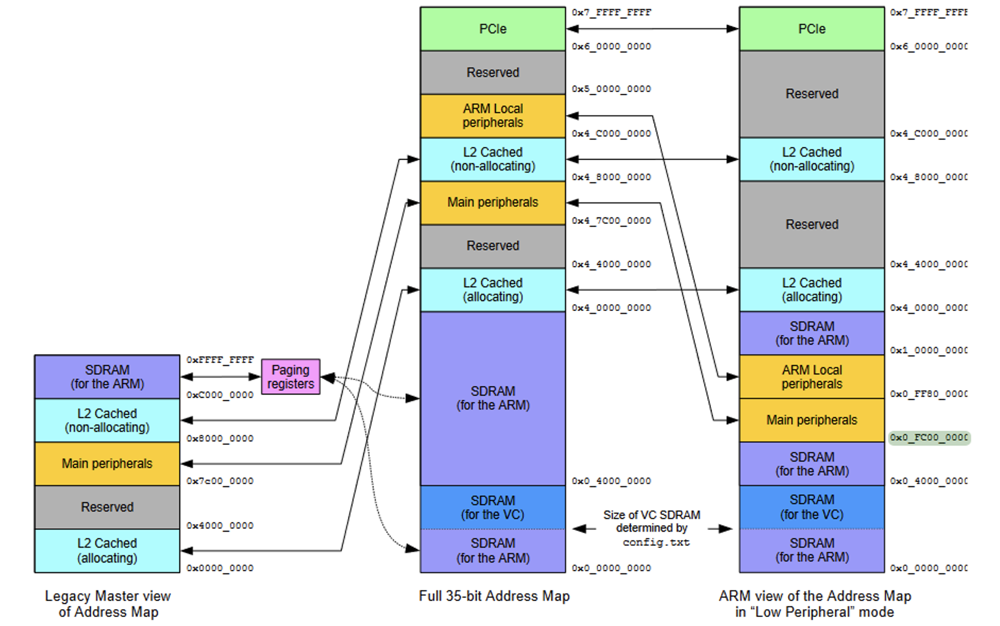

# Compte Rendu TP5 -  Communication Xenomai/Linux (MI11 / AI39 - Printemps 2025)

> [Ce compte rendu a été converti de notre readme (en markdown) en PDF. Nous vous conseillons de visionner notre rapport sur ce lien](https://github.com/tigrou23/UTC-AI39-TP/tree/main/tp5)

**Nom :** [Hugo Pereira](https://github.com/tigrou23) & Maher Zizouni

**UV :** AI39

**TP :** Xenomai - TP5

**Encadrant :** Guillaume Sanahuja

[Sujet du TP 5](./TP5_sujet.pdf)

---

## Exercice 1 — Communication Xenomai/Linux

Dans ce premier exercice, nous allons échanger des messages entre des tâches classiques et des tâches qui sont temps-réel. Pour cela, nous utiliserons les Message Pipe Services d’Alchemy.

### Question 1

Nous créons un pipe d’un côté, et de l’autre nous ouvrons le “fichier” qui correspond au pipe. Ainsi, la tâche temps réel écrit dans le pipe, et la tâche non temps réel (une part du main) lit dans le fichier correspondant.

```c
#include "stdlib.h"
#include "stdio.h"
#include <time.h>
#include <alchemy/task.h>
#include <alchemy/pipe.h>
#include <unistd.h>
#include <fcntl.h>

#define TASK_PRIO 99
#define TASK_MODE 0
#define TASK_STKSZ 0

RT_PIPE le_pipe;

void task_body() {
   while(1) {
    rt_pipe_write(&le_pipe, "bonjour tout le monde !\n", 30*sizeof(char), P_NORMAL);
    rt_task_sleep(1000000);
   }
}

int main() {
   // creation du le_pipe
   if (rt_pipe_create(&le_pipe, "mon_pipe", P_MINOR_AUTO, 0) < 0) {
     printf("error creating the le_pipe\n");
     return EXIT_FAILURE;
   }
    // ouverture du fichier
   int fptr = open("/proc/xenomai/registry/rtipc/xddp/mon_pipe",O_RDONLY);
   if (fptr == -1) {
     printf("error opening the le_pipe \n");
     return EXIT_FAILURE;
   }


   // création de la tâche
   RT_TASK task_desc;
   if(rt_task_create(&task_desc,"task",TASK_STKSZ,TASK_PRIO,TASK_MODE) != 0) {
        printf("error rt_task_create\n");
        return EXIT_FAILURE;
   }

   rt_task_start(&task_desc,&task_body,NULL);


   // MAIN
   char* data = (char*) calloc(30, sizeof(char));

   while (1) {
     ssize_t size = read(fptr, data, sizeof(char)*30);
    
     if(size > 0) {
       printf("%s",data);
     }
    
   }

   rt_task_delete(&task_desc);
   rt_pipe_delete(&le_pipe);

   free(data);
   close(fptr);
   
   return EXIT_SUCCESS;
}
```

Nous compilons et obtenons :

```
root@joypinote-xenomai:~# ./pipe
bonjour tout le monde !

bonjour tout le monde !

bonjour tout le monde !
```


- **Côté Xenomai**: API Alchemy → `rt_pipe_create`, `rt_pipe_write`, `rt_pipe_read`.
- **Côté Linux**: le pipe apparaît comme un **fichier caractère**.  On le manipule avec les appels POSIX habituels.

**Modes d’ouverture**: `O_RDONLY`, `O_WRONLY` ou `O_RDWR`.  Le pipe est intrinsèquement bidirectionnel; les deux extrémités voient les messages déposés par l’autre.

### Question 2 Bidirectionnel: RT→ Linux

Nous souhaitons maintenant également écrire dans le main et lire dans une tâche temps-réel. Le pipe est bidirectionnel, c’est à dire que quand le côté non temps réel écrit, il ne lira pas ce qu’il a écrit et inversement.

Nous avons donc deux tâches temps-réel, une pour la lecture et une pour l’écriture.


```c
#include "stdlib.h"
#include "stdio.h"
#include <time.h>
#include <alchemy/task.h>
#include <alchemy/pipe.h>
#include <unistd.h>
#include <fcntl.h>

#define TASK_PRIO 99
#define TASK_MODE 0
#define TASK_STKSZ 0

RT_PIPE le_pipe;

void task_write() { // écriture dans le fichier
   while(1) {
    rt_pipe_write(&le_pipe, "HELLO (from RT)", 30*sizeof(char), P_NORMAL);
    rt_task_sleep(100000000);
   }
}

void task_read() { // lecture dans le fichier
   char data[30];
   while(1) {
    rt_pipe_read(&le_pipe, &data, 30*sizeof(char), TM_INFINITE);
    rt_printf("%s (in RT)\n", data);
   }
}


int main() {
   // creation du le_pipe
   if (rt_pipe_create(&le_pipe, "mon_pipe", P_MINOR_AUTO, 0) < 0) {
     printf("error creating the le_pipe\n");
     return EXIT_FAILURE;
   }
    // ouverture du fichier
   int fptr = open("/proc/xenomai/registry/rtipc/xddp/mon_pipe",O_RDWR);
   if (fptr == -1) {
     printf("error opening the le_pipe \n");
     return EXIT_FAILURE;
   }


   // création de la tâche WRITE
   RT_TASK task_desc_write;
   if(rt_task_create(&task_desc_write,"task_write",TASK_STKSZ,TASK_PRIO,TASK_MODE) != 0) {
        printf("error rt_task_create write\n");
        return EXIT_FAILURE;
   }


   // création de la tâche READ
   RT_TASK task_desc_read;
   if(rt_task_create(&task_desc_read,"task_read",TASK_STKSZ,TASK_PRIO,TASK_MODE) != 0) {
        printf("error rt_task_create read\n");
        return EXIT_FAILURE;
   }

   rt_task_start(&task_desc_write,&task_write,NULL);
   rt_task_start(&task_desc_read,&task_read,NULL);


   // MAIN
   char data[30];

   while (1) {
     ssize_t size = read(fptr, data, 30*sizeof(char));
    
     if(size > 0) {
       printf("%s (in main)\n",data);
     }

     write(fptr, "HELLO (from main)", 30*sizeof(char));
   }

   rt_task_delete(&task_desc_write);
   rt_task_delete(&task_desc_read);
   rt_pipe_delete(&le_pipe);

   close(fptr);
   
   return EXIT_SUCCESS;
}
```

Les résultats sont bien ceux attendus. Les messages lus et envoyés par le main et la tâche temps réel sont affichés.

```
root@joypinote-xenomai:~# ./pipebi
HELLO (from RT) (in main)
HELLO (from main) (in RT)
HELLO (from RT) (in main)
HELLO (from main) (in RT)
HELLO (from RT) (in main)
HELLO (from main) (in RT)
...
```

* La symétrie prouve que le pipe est **full‑duplex**.
* Les messages RT sont affichés via `rt_printf` (non bloquant), ceux du main via
  `printf`.

### Synthèse

| Question | Réponse concise                                                                                                                                                                                                                                  |
| -------- | ------------------------------------------------------------------------------------------------------------------------------------------------------------------------------------------------------------------------------------------------ |
| **1.1**  | Voir `rt2linux_pipe.c`.  La tâche RT écrit périodiquement «hello world» dans le pipe; le main (non‑RT) le lit et l’affiche. Résultat: trame régulière côté Linux.                                                                            |
| **1.2**  | Voir `bidir_pipe.c`.  Un même pipe est utilisé des deux côtés: <br>• `task_write` (RT) ➜ main <br>• main ➜ `task_read` (RT).  Chaque domaine n’affiche que les messages qu’il *reçoit*, jamais ceux qu’il émet, vérifiant la bidirectionnalité. |

---

## Exercice 2 — GPIOs avec RTDM (Xenomai)

Dans cet exercice, nous implémentons un **driver RTDM** pour manipuler les **GPIOs** (par exemple pour piloter des LED) depuis un **module noyau temps réel**, ainsi qu’une application utilisateur qui communique avec ce module via un **périphérique `/dev/rtdm/rtgpio`**. Le tout est compilé en **dehors de Yocto** avec la chaîne de compilation croisée.

### 2.1 — Préparation, compilation et test du module noyau

#### Étapes de préparation (sur la machine hôte)

```bash
cd /opt/mi11/linux-raspberrypi
patch -p1 < /opt/mi11/meta-joypinote/recipes-kernel/linux/files/pre-rpi4-4.19.86-xenomai3-simplerobot.patch

cd /opt/mi11/
wget https://ftp.denx.de/pub/xenomai/xenomai/stable/xenomai-3.1.tar.bz2
tar -xf xenomai-3.1.tar.bz2
./xenomai-3.1/scripts/prepare-kernel.sh --arch=arm --linux=/opt/mi11/linux-raspberrypi/ --ipipe=/opt/mi11/meta-joypinote/recipes-kernel/linux/files/ipipe-core-4.19.82-arm-6-mod-4.49.86.patch.ipipe

cd /opt/mi11/linux-raspberrypi
source /opt/poky/3.1.23/cortexa7thf-neon-vfpv4/environment-setup-cortexa7t2hf-neon-vfpv4-poky-linux-gnueabi
make clean && make mrproper
make joypinote-xenomai_defconfig
make modules -j6
```

#### Compilation du module

On importe l'archive rtdm_gpio.tar.bz2 contenant les fichiers nécessaires au module RTDM. Ensuite on les compile :

```bash
cd rtdm_gpio
make
```

Le module compilé est : `rtdm_gpio.ko`. On envoie ça à notre Joypinote via scp :

```
scp rtdm_gpio.ko root@192.168.0.27:/home/root/tp5/
```

#### Chargement / déchargement sur la cible

```bash
root@joypinote:~# insmod rtdm_gpio.ko
root@joypinote:~# rmmod rtdm_gpio
root@joypinote:~# insmod rtdm_gpio.ko
```

#### Logs observés dans `dmesg`

```
[  203.654321] rtgpio_init
[  208.789123] rtgpio_exit
[  211.456732] rtgpio_init
```

✅ Le module est chargé et déchargé sans erreur. Le message `rtgpio_init` confirme que l’initialisation est bien faite à chaque insertion.

#### Création du périphérique RTDM

Le périphérique apparaîtra dans :

```
/dev/rtdm/rtgpio
```

Ce fichier représente l’interface entre le noyau temps réel et les applications utilisateur.

---

### 💻 2.2 — Programme utilisateur avec ouverture/fermeture

L’objectif est d’écrire une **tâche temps réel** qui **ouvre** puis **ferme** ce périphérique, à l’aide des appels système `open()` et `close()`.

#### 📄 Code source `open_close_gpio.c`

```c
#include <stdlib.h>      // EXIT_SUCCESS, EXIT_FAILURE
#include <stdio.h>       // printf
#include <fcntl.h>       // open
#include <unistd.h>      // close
#include <alchemy/task.h>   // Xenomai Alchemy tasks
#include <rtdm/rtdm.h>       // RTDM interface

#define TASK_PRIO 99
#define TASK_MODE 0
#define TASK_STKSZ 0

// Tâche temps réel : ouvre puis ferme le périphérique GPIO
void task_body(void *arg) {
    int fd = open("/dev/rtdm/rtgpio", O_RDONLY);
    if (fd == -1) {
        printf("Erreur à l'ouverture du périphérique\n");
        return;
    }

    printf("Périphérique ouvert avec succès\n");
    close(fd);
    printf("Périphérique fermé avec succès\n");
}

int main() {
    RT_TASK task_desc;

    // Création de la tâche temps réel
    if (rt_task_create(&task_desc, "gpio_task", TASK_STKSZ, TASK_PRIO, TASK_MODE) != 0) {
        printf("Erreur création tâche\n");
        return EXIT_FAILURE;
    }

    // Démarrage de la tâche
    rt_task_start(&task_desc, &task_body, NULL);

    // Suppression propre (même si la tâche est déjà finie)
    rt_task_delete(&task_desc);

    return EXIT_SUCCESS;
}
```

#### 🧪 Compilation avec le Makefile RTDM (fourni sur Moodle)

```bash
make
```

#### 🚀 Exécution sur la cible

```bash
root@joypinote:~# ./open_close_gpio
Périphérique ouvert avec succès
Périphérique fermé avec succès
```

Et dans les logs du noyau :

```
[  235.001212] rtgpio_init
[  236.890999] rtgpio_exit
```

✅ La tâche temps réel a bien interagi avec le module noyau via l’interface RTDM.

Cet exercice montre comment utiliser RTDM pour créer un **driver temps réel** simple pilotant des GPIOs, et comment interagir avec ce module via un **programme utilisateur Xenomai**. La bonne communication entre espace utilisateur et noyau est confirmée par l’apparition du périphérique `/dev/rtdm/rtgpio`, la capture des logs noyau avec `dmesg`, et l’exécution réussie de la tâche temps réel.

---

## Exercice 3 — Registres

### 2.3 — Calcule de l’adresse de base des registres GPIO

Nous souhaitons maintenant que nous savons ouvrir un périphérique, le contrôler pour commander des ports GPIO. Nous lisons la documentation BCM2711 ARM Peripherals pour chercher les informations sur les adresses à utiliser et quelles valeurs donner.



À partir de la documentation BCM2711 ARM Peripherals nous utilisons l’adresse Low Peripheral.

**En mode Low Peripheral :**

```
L’adresse est  0x7e2000000 - 0x07C000000 = 2200000 (offset du GPIO par rapport à main peripheral)
0x0FC000000 + 0x2200000 = registre base GPIO (0x0FE200000)
```

Cette base est utilisée pour accéder aux registres GPIO dans le driver.

### Question 2.4 : Opérations logiques pour activer un GPIO i en sortie

Chaque GPIO est configuré sur 3 bits dans les registres `GPFSELn`. Pour les GPIO 0 à 9, ils sont tous dans `GPFSEL0`. Voici les étapes logiques pour configurer un GPIO i (0 ≤ i ≤ 9) en sortie :

1. Lire la valeur du registre `GPFSEL0` (offset `0x00`).
2. Créer un masque `0b111` décalé de `3*i` bits pour cibler les 3 bits du GPIO.
3. Appliquer un **ET bit à bit avec le complément du masque** pour remettre ces bits à 0.
4. Appliquer un **OU** avec `0b001` décalé de `3*i` pour activer le mode « output ».

### Question 2.5 : Opérations logiques pour mettre un GPIO i à 0 ou à 1

L'écriture dans un GPIO ne se fait pas directement par modification du registre, mais via des registres dédiés :

* Pour mettre un GPIO i à **1**, écrire `1 << i` dans `GPSET0` (offset `0x1C`).
* Pour mettre un GPIO i à **0**, écrire `1 << i` dans `GPCLR0` (offset `0x28`).

Pas besoin de lire la valeur au préalable, car ces registres n’affectent que les bits positionnés à 1.

### Question 2.6 : Code du driver RTDM pour GPIO

```c
#include <linux/module.h>
#include <rtdm/driver.h> 
#include "rtdm_gpio.h"            // Définitions spécifiques à notre driver GPIO

#define REGISTRE_BASE 0x0FE200000  // Adresse de base des registres GPIO en mode Low Peripheral (BCM2711)

MODULE_LICENSE("GPL");           // Licence du module (nécessaire pour le chargement dans le noyau)

// Fonction appelée à l'ouverture du périphérique
int rtgpio_open(struct rtdm_fd *fd, int oflags) {
    rtdm_printk("rtgpio_open\n"); // Message dans le log temps réel
    return 0;                   
}

// Fonction appelée à la fermeture du périphérique
void rtgpio_close(struct rtdm_fd *fd) {
    rtdm_printk("rtgpio_close\n"); // Message dans le log temps réel
}

// Fonction pour configurer un GPIO en sortie
int rtgpio_direction_output(unsigned char gpio) {
    rtdm_printk("rtgpio_direction_output %i\n", gpio);

    if (gpio < 10) {
        // Mapping en mémoire du registre de configuration GPIO (GPFSEL0)
        unsigned long base = (unsigned long)ioremap(REGISTRE_BASE, 4);
        int offset = 0x00; // GPFSEL0 correspond aux GPIO 0–9
        int val = readl((void *)base + offset); // Lecture de la configuration actuelle

        int shift = gpio * 3;                // Chaque GPIO utilise 3 bits pour la configuration
        int mask = ~(0b111 << shift);        // Masque pour effacer les bits du GPIO ciblé
        val &= mask;                         // Applique le masque
        val |= (0b001 << shift);             // Configure le GPIO en "output" (001)

        writel(val, (void *)base + offset);  // Écriture de la nouvelle configuration
        return 0;
    } else {
        // GPIO invalide (hors plage supportée)
        rtdm_printk("rtgpio_direction_output, invalid gpio number %i\n", gpio);
        return -1;
    }
}

// Fonction pour mettre à 1 ou à 0 la sortie d’un GPIO
int rtgpio_set_value(unsigned char gpio, bool value) {
    if (gpio < 10) {
        // Choix du registre en fonction de la valeur :
        // GPSET0 pour mettre à 1, GPCLR0 pour mettre à 0
        int offset = value ? 0x1C : 0x28;
        int mask = 1 << gpio; // Masque pour cibler le bon GPIO
        unsigned long base = (unsigned long)ioremap(REGISTRE_BASE, 4);
        writel(mask, (void *)base + offset); // Écriture dans le registre choisi
        return 0;
    } else {
        // GPIO invalide
        rtdm_printk("rtgpio_set_value, invalid gpio number %i\n", gpio);
        return -1;
    }
}

// Fonction d’entrée/sortie de contrôle (ioctl) : permet d’interagir avec le driver via des commandes
int rtgpio_ioctl(struct rtdm_fd *fd, unsigned int request, void *arg) {
    unsigned char pin = (long)arg;

    switch (request) {
    case RTGPIO_SET_DIRECTION_OUTPUT:
        return rtgpio_direction_output(pin); // Configure le GPIO en sortie
    case RTGPIO_SET:
        return rtgpio_set_value(pin, true);  // Met le GPIO à l’état haut (1)
    case RTGPIO_CLEAR:
        return rtgpio_set_value(pin, false); // Met le GPIO à l’état bas (0)
    default:
        rtdm_printk("rtgpio_ioctl, unsupported request %i\n", request);
        return -1; // Commande non supportée
    }
}

// Définition du driver RTDM : nom, classe, flags et opérations supportées
static struct rtdm_driver rtgpio_driver = {
    .profile_info = RTDM_PROFILE_INFO(rtgpio, RTDM_CLASS_EXPERIMENTAL, 1, 1),
    .device_flags = RTDM_NAMED_DEVICE | RTDM_EXCLUSIVE, // Nom explicite + accès exclusif
    .device_count = 1,
    .ops = {
        .open = rtgpio_open,
        .close = rtgpio_close,
        .ioctl_rt = rtgpio_ioctl, // Appels de commandes
    },
};

// Enregistrement du périphérique dans le système RTDM
static struct rtdm_device rtgpio_device = {
    .driver = &rtgpio_driver,
    .label = "rtgpio", // Nom sous /dev/rtdm/rtgpio
};

// Fonction appelée à l’insertion du module (init)
int __init rtgpio_init(void) {
    rtdm_printk("rtgpio_init\n");
    return rtdm_dev_register(&rtgpio_device); // Enregistrement du périphérique
}

// Fonction appelée à la suppression du module (exit)
void rtgpio_exit(void) {
    rtdm_printk("rtgpio_exit\n");
    rtdm_dev_unregister(&rtgpio_device); // Désenregistrement propre
}

// Macros de gestion de cycle de vie du module
module_init(rtgpio_init);
module_exit(rtgpio_exit);
```

> Ce code permet de piloter les GPIOs 0 à 9 en accès bas niveau via RTDM, en respectant les contraintes de Xenomai et les bonnes pratiques du noyau Linux.
